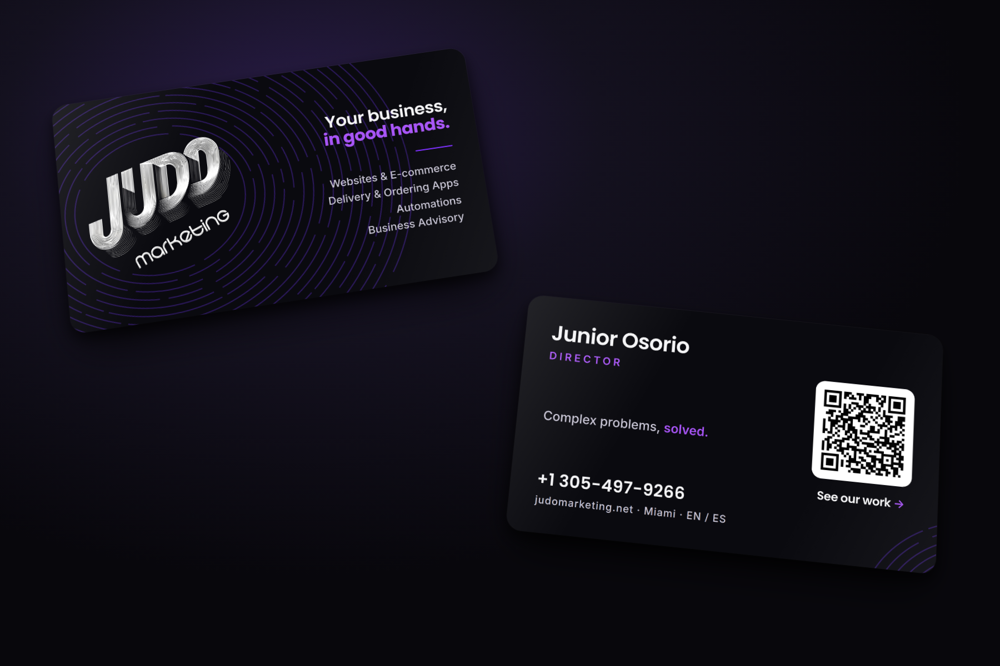

# Tarjetas de presentación (PVC negro)

Tarjeta de Junior Osorio, Director, hecha en octubre de 2026. Fondo negro con
los colores del website, para imprimir en **plástico negro**.

## La idea

- **Frente:** el logo grande, "Your business, in good hands." y lo que
  hacemos (Websites & E-commerce, Delivery & Ordering Apps, Automations,
  Business Advisory): la promesa y la oferta en la misma cara. Detrás, una
  huella hecha con las mismas líneas concéntricas del logo: la mano que
  cuida el negocio. Va impresa tono sobre tono (morado oscuro sin tinta
  blanca debajo), así que casi no se nota hasta que le da la luz.
- **Dorso:** solo la persona y cómo llegar a ella, en tres grupos con aire
  entre ellos: nombre y cargo arriba, "Complex problems, solved." al medio,
  teléfono y web abajo; a la derecha el QR al showcase. Sin correo
  (decisión de Junior, 7 de octubre de 2026).
- **Márgenes de 5.5 mm** por lado (9 de octubre de 2026): en la primera
  prueba en Uprintly todo se veía pegado al borde, porque se subió la
  medida de tarjeta de crédito a una tarjeta de 3.5 x 2 y la recortaron.
  Ahora la medida principal es 3.5 x 2 y nada queda cerca del corte.
- **El QR** apunta a `judomarketing.net/card`, un enlace corto nuestro
  (`next.config.ts`) que manda al showcase con marca de origen en Analytics
  (`utm_source=business_card`). Así se ve cuántas visitas trae la tarjeta, y
  si un día el QR debe llevar a otra página se cambia ahí, sin reimprimir.

## Archivos

| Carpeta | Qué hay |
| --- | --- |
| `imprenta/` | Los PDF para la imprenta. `cr80`: 85.6 x 54 mm (tamaño tarjeta de crédito, el normal en plástico). `us`: 3.5 x 2 in (tamaño de tarjeta de papel). Cada uno con frente y dorso, en `color` (el arte) y `blanco` (la placa de tinta blanca). Todos con 1/8" de sangrado. |
| `alta/` | Los originales en alta definición, PNG a 1200 dpi. **Para Uprintly u otra imprenta en línea se sube `us-frente-con-sangrado.png` y `us-dorso-con-sangrado.png`** (3.75 x 2.25 in: la tarjeta de 3.5 x 2 más 1/8" por lado). Los `-final.png` son la medida ya cortada, para compartir. Se sacan con `node docs/tarjetas/alta.mjs`. |
| `vista/` | Imágenes para mirar: cada cara, cada cara con guías de corte y zona segura, y `mockup.png`. |
| `tarjeta.html` | El diseño. Se edita aquí. |
| `generar.mjs`, `mockup.mjs` | Vuelven a sacar los PDF y las vistas: `node docs/tarjetas/generar.mjs && node docs/tarjetas/mockup.mjs`. |
| `fuentes/` | Poppins e Inter con su licencia (OFL), para que salga igual en cualquier máquina. |

## Para la imprenta (en inglés, para copiar)

> Black PVC cards, 3.5 x 2 in, rounded corners, printed both sides. Files:
> `us-frente-color.pdf` / `us-dorso-color.pdf` (CMYK art) and
> `us-frente-blanco.pdf` / `us-dorso-blanco.pdf` (white ink
> plate: black = white ink underneath). Do **not** print the black
> background: it is the card itself. All text, the logo, the purple accents
> and the QR tile get a white underbase. The dark purple concentric lines on
> both sides are intentionally printed **without** white (tone on tone).
> 1/8" bleed included, safe area 5.5 mm. Please send a proof and test-scan
> the QR before the full run.

Si la imprenta pide un solo archivo con la tinta blanca como color directo
(spot "White"), se le mandan los dos PDF y ellos los unen, o se arma en
Illustrator poniendo la placa encima con sobreimpresión.

## Lo que hay que saber del plástico negro

- **Sin tinta blanca debajo, los colores no se ven** sobre negro: por eso va
  la placa. Si la imprenta no tiene tinta blanca, que imprima sobre PVC blanco
  con el fondo negro impreso (el PDF a color ya lo trae) y se ve igual.
- **El logo tiene líneas muy finas.** En la prueba hay que mirar que no se
  tapen. Si se tapan, la mejor opción es imprimir el logo en **foil
  plateado**, que además combina con el logo cromado de la marca.
- **El QR mide 21 mm** con fondo blanco: se lee a la primera con cualquier
  teléfono (el mínimo recomendado en plástico es 20 a 25 mm).
- **Extra que vale la pena:** muchas imprentas de plástico meten un chip
  **NFC**: el cliente acerca el teléfono y se abre el showcase, sin
  escanear. Se programa con la misma dirección, `https://www.judomarketing.net/card`.

## Si algo cambia

Si cambian el teléfono, el cargo o los servicios, se edita `tarjeta.html` y
se vuelve a correr `generar.mjs` y `mockup.mjs`.
